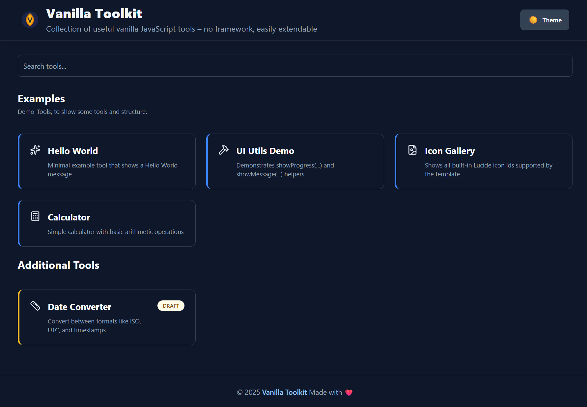

# Browser Toolkit



Minimal, lightning-fast tool collection  
Vite + TypeScript + Tailwind – **no React, no framework**

## Table of Contents

- [Commands](#commands)
- [Features](#features)
- [Create a new tool (30 seconds)](#create-a-new-tool-30-seconds)
- [Tool-specific dependencies (Bun workspaces)](#tool-specific-dependencies-bun-workspaces)
- [Share Target for Tools (PWA)](#share-target-for-tools-pwa)
- [Ordering & Section grouping (Overview page)](#ordering--section-grouping-overview-page)
- [Tool Icons (Lucide)](#tool-icons-lucide)
- [WebAssembly (WASM) Modules](#webassembly-wasm-modules)
- [Modern Browser APIs](#modern-browser-apis)
- [Touch & Responsive Design](#touch--responsive-design)
- [Error Handling](#error-handling)
- [Shared Utilities](#shared-utilities)
- [Template Placeholders](#template-placeholders)
- [Dark/Light Mode](#darklight-mode)
- [Extending `SiteContext` (derived projects)](#extending-sitecontext-derived-projects)
- [Keeping Derived Projects Up-to-Date (Template Sync Workflow)](#keeping-derived-projects-up-to-date-template-sync-workflow)

## Commands

```bash
# Development
bun run dev          # Start Vite dev server
bun run preview      # Preview production build on port 5000

# Build & Type Check
bun run build        # Production build (Vite build)
bun x tsc            # Type check only (tsc --noEmit)

# Formatting
bun run format       # Format all source files with Prettier (avoid by default for focused edits)
bun run format:check # Check formatting without writing

# Utilities
bun run clean        # Remove dist and node_modules/.vite
bun run upgrade:check# Check outdated dependencies
bun run upgrade:deps # Update dependencies to latest
```

## Features

- Add new tools via folder → appear automatically
- Search function with live filter
- Unified design with header & footer
- 100% offline-capable
- **Optional Backend**: Support for tools that require a server.

## Optional Backend Server

While this toolkit is designed to be 100% offline-capable and static, it includes an optional backend built with **Bun** and **Hono** to support tools that require server-side functionality (like a SQLite database).

### Two Modes:

1. **Static/Offline Mode**: The default mode. When served statically (e.g., GitHub Pages) or accessed entirely offline, any tool marked with `"requiresBackend": true` in its `config.json` is silently hidden.
2. **Backend Mode**: When run with the Bun backend, the backend serves both the `dist/` frontend and API routes. The frontend detects the backend and enables backend-dependent tools.

### How to Start the Backend

Make sure you have [Bun](https://bun.sh/) installed.

1. Build the frontend:
   ```bash
   bun run build
   ```
2. Start the backend server:
   ```bash
   cd backend
   bun install
   bun start
   ```
   _The backend will automatically serve the static `dist/` directory on `http://localhost:3000`._

### Update Automation (Backend Mode)

The `backend-info` tool can now check for updates and trigger an in-place update on a running server.

- The update flow runs from inside the `backend/` working directory and assumes the app root is `../`.
- It performs: `git fetch`/compare, `git pull`, root `bun install`, frontend build, backend `bun install`.
- Frontend build uses `dist_next` and then swaps folders to reduce broken serve windows during rebuild.
- On successful web-triggered update, the backend exits and relies on **systemd auto-restart**.

When running from a packaged release without a git working tree and build inputs, automatic update actions are marked unsupported. In this mode `backend-info` keeps system metrics but disables update controls and shows a manual update message.

Important for service setup:

- Ensure your systemd unit has automatic restart enabled (for example `Restart=always`).
- No restart token is required for the current update endpoint design.

#### Server CLI usage (inside `backend/`)

```bash
cd backend
bun run update            # normal update run
bun run update --force    # force install/build even when no git changes
bun run update --check    # check-only, no pull/build
```

## Create a new tool (30 seconds)

Create a folder inside `src/tools/`.
The folder name becomes the tool’s **path/URL slug**.

```bash
src/tools/my-tool/
├── config.json     # Name + description + configuration
├── template.html   # Your layout
└── index.ts        # Your logic (optional)
```

### 1) Add `config.json`

Minimal example:

```json
{
  "name": "My Tool",
  "description": "Does something useful",
  "draft": false,
  "example": false
}
```

Notes:

- `name` and `description` are shown on the overview page and used for search.
- `draft: true` hides the tool from the normal overview (useful while you’re still building it).
- `example: true` is intended for template/demo tools (you can ignore it in real projects).

Optional fields you can add later:

- `icon`: an icon id (see **Tool Icons (Lucide)** below)
- `order` / `sectionId`: for sorting & grouping (see next section)
- `hideHeader`: set to `true` to hide the site header for this tool
- `hideFooter`: set to `true` to hide the site footer for this tool

### 2) Add `template.html`

This is the tool’s UI. Keep it small and composable (cards, inputs, buttons).

- Prefer semantic HTML (`label`, `input`, `button`)—it improves accessibility quickly.
- Prefer using daisyUI component classes together with Tailwind utility classes for consistent UI patterns.
- Avoid heavy use of Tailwind's `dark:` prefix — prefer daisyUI themes or CSS variables for theme-aware styling (examples below).

Practical tips:

- Give your tool a single root container so it’s easy to render/replace.
- Keep IDs and selectors scoped to your tool root where possible.

### 3) Add behavior in `index.ts` (optional)

If your tool is interactive, put the logic in `index.ts`.
Typical responsibilities:

- Wire up event listeners (click, input, submit)
- Read/write values from the DOM
- Implement the actual tool logic (formatting, conversions, generators, etc.)

Keep it defensive:

- Validate user input before processing
- Handle empty states (e.g. “nothing entered yet”)
- Avoid throwing on malformed input—show a message instead

**Export style**

Use a default `init()` export for tool entries:

```ts
export default function init(): void | (() => void) {
  // ...
  return () => {
    // cleanup
  };
}
```

**Important: cleanup when navigating between tools**

Tools can be opened/closed via routing, so your `index.ts` may run multiple times.
If you attach any **global** listeners (e.g. `document.addEventListener`, `window.addEventListener`), timers (`setInterval`), observers, etc.,  
make sure you return a **cleanup function** that removes them.

Prefer listeners on tool-local container elements first. Use global listeners only when there is no practical local alternative.

```ts
export default function init() {
  const onKeyDown = (e: KeyboardEvent) => {
    // ...
  };
  document.addEventListener('keydown', onKeyDown);

  // Return cleanup to prevent duplicate listeners when navigating away/back
  return () => {
    document.removeEventListener('keydown', onKeyDown);
  };
}
```

Rule of thumb:

- Listeners on elements that get replaced with the tool DOM are usually fine.
- Anything attached to `document` / `window` should be cleaned up.

Lifecycle note:

- Routing lifecycle cleanup/cancellation is centralized in `src/js/render.ts`.
- `render.ts` manages tool cleanup (`currentToolCleanup`), settings cleanup (`settingsCleanup`), and pending init cancellation (`cancelPendingInit`) during navigation.
- Tool scripts should return cleanup from `init()` and let the renderer orchestrate lifecycle transitions.

### 4) Run it

Start the dev server and open the app:

```bash
bun run dev
```

Your tool should appear automatically on the overview page.
If it doesn’t:

- Check that the folder is directly under `src/tools/<tool-name>/`
- Ensure `config.json` is valid JSON (no trailing commas)
- Restart the dev server after renaming folders/files

### Common patterns (quick checklist)

- **Hide until ready:** set `"draft": true`
- **Make it discoverable:** write a clear `description` (it powers search)
- **Keep it stable:** don’t rename the folder unless you’re okay with the URL changing

## Tool-specific dependencies (Bun workspaces)

Each tool can declare its own dependencies by adding a `package.json` inside its folder.  
This is supported by the project’s Bun workspace setup in root `package.json`.

**Example:**  
The tool `example-package` in this project adds its own dependencies:  
_(demo purpose only with a lightweight dependency)_

`// src/tools/example-package/package.json`

```json
{
  "name": "example-package",
  "version": "1.0.0",
  "dependencies": {
    "is-odd": "3.0.1"
  }
}
```

- Run `bun install` at the project root to install all tool dependencies.
- Each tool’s dependencies are isolated and won’t affect others.
- Avoid adding dependencies unless needed. Prefer shared utilities in `src/js/*` first.

> Note:
> This allows tools to use different libraries or versions as needed,
> without polluting the main project dependencies.

## Share Target for Tools (PWA)

Tools can register as **share targets** to receive files shared from other apps (for example via the Android share menu or "Open with" on desktop).
When a file is shared to the PWA, the app routes to the appropriate tool based on MIME type.

### How to enable share target for a tool

Add a `shareTarget` field to your tool's `config.json`:

```json
{
  "name": "Image Redactor",
  "description": "Crop, Redact and pixelate Images",
  "icon": "crop",
  "sectionId": "images",
  "shareTarget": {
    "accept": ["image/*"]
  }
}
```

The `accept` array contains MIME type patterns:

- Exact types: `"image/png"`, `"application/pdf"`, `"text/plain"`
- Wildcards: `"image/*"` (matches all image types), `"text/*"` (matches all text types)

### Handling shared files in your tool

When files are shared to your tool, the `init` function receives a payload containing the shared files:

```ts
import type { SharedFilesPayload } from '../../js/share-target';

export default function init(payload?: SharedFilesPayload) {
  // Check if files were shared
  if (payload?.sharedFiles?.length) {
    const file = payload.sharedFiles[0];
    // Process the shared file
    loadFile(file);
  }

  // ... rest of your tool logic
}
```

The `SharedFilesPayload` interface:

```ts
interface SharedFilesPayload {
  sharedFiles: File[]; // Array of shared files
  mimeTypes: string[]; // MIME types of the shared files
  text?: string; // Optional shared text
}
```

### How it works

1. When a file is shared to the PWA, the service worker intercepts the request
2. Files are temporarily stored in IndexedDB
3. The app reads URL parameters to detect shared content
4. The app finds the first tool whose `shareTarget.accept` matches the file's MIME type
5. The app navigates to that tool and passes the files as payload

### Notes

- Only the first matching tool receives the shared files (based on tool load order)
- Shared files are automatically cleaned up from IndexedDB after 1 hour
- Make sure your tool's dropzone/file input accepts the same file types

## Ordering & Section grouping (Overview page)

Tools can be **sorted** and **grouped into sections** on the overview page by adding two optional fields to a tool’s `config.json`:

- `order` _(number)_: controls the position within a section (ascending)
- `sectionId` _(string)_: groups tools into a named section

### Example `config.json`

```json
{
  "name": "My Tool",
  "description": "Does something useful",
  "draft": false,
  "example": false,
  "sectionId": "examples",
  "order": 1
}
```

### How sorting works

- Tools are sorted by:
  1. `order` (ascending)
  2. `name` (A → Z) as a tie-breaker

This means you can keep the list stable and intentional, even when multiple tools share the same `order`.

### How sections work

- Tools with the same `sectionId` are rendered under the same section header.
- Section header text (title + optional description) is configured in the site config (see below).
- If a tool has a `sectionId` that is **not configured**, the UI falls back to showing the raw `sectionId` as the section title.
- If a tool has **no** `sectionId`, it is grouped into a default “other” section.

### Configure section titles via `SiteConfig`

Section titles and descriptions live in the site configuration.

1. Edit the site config:
   - `src/config/site.config.ts`
2. Define your sections (keys are the `sectionId`s):

```ts
export const siteConfig = {
  // ...
  toolSections: {
    examples: { title: 'Examples', description: 'Demo tools that show how the template works.' },
    general: { title: 'General', description: 'Everyday helpers and utilities.' },
  },
};
```

**Section order:**  
Sections are rendered in the insertion order of `toolSections` first, followed by any additional sections discovered at runtime.

### Site configuration override

The configuration lives in `src/config/site.config.ts`.
To customize the configuration for your project, change the values you need in this file.
See `src/config/types.ts` for available configuration fields.

## Tool Icons (Lucide)

Each tool can optionally define an icon in its `config.json`.

Use icon IDs in Lucide format (lowercase with dashes).

If `icon` is missing or unknown, a default icon is used.

### Available icon ids

By default, all Lucide icons are included.
You can register additional icons at startup.

### Register custom icons (derived projects)

This template exposes an icon registry so derived projects can add (or override) icon IDs without editing `src/js/tool-icons.ts`.

1. Import `registerToolIcons` in your entry file (e.g. `src/script.ts`).

2. Import additional icons from `lucide` (or another compatible source).

3. Register them at once during startup.

```ts
import { registerToolIcons } from './js/tool-icons';
import { ArrowLeft } from 'lucide';

registerToolIcons({
  ArrowLeft,
  // add more icons here
});
```

For regular tool code, do not call `createIcons()` manually. Use `data-lucide` in HTML and let the observer render icons.

Now you can reference your new icon IDs from any tool `config.json`:

```json
{
  "name": "My Tool",
  "description": "Does something useful",
  "icon": "arrow-left"
}
```

Notes:

- If an ID is unknown, the renderer falls back to a default icon.
- If you register an existing ID, it will override the built-in icon for that ID.

---

## WebAssembly (WASM) Modules

This project includes Vite aliases for several WASM modules, available for tools that need them:

- `@ffmpeg` - FFmpeg for audio/video processing
- `pandoc-wasm` - Document conversion
- `onnx` - ONNX runtime for ML inference

**Usage:** Use dynamic imports for lazy loading:

```ts
const onnx = await import('onnxruntime-web');
// use onnx for inference
```

**Important:** When using WASM, always free and destroy allocated memory when done to prevent memory leaks.

---

## Modern Browser APIs

Use modern browser features freely. Always check for API availability and provide user feedback when unavailable.

```ts
// Clipboard API with detection
async function copyToClipboard(text: string): Promise<boolean> {
  if (!navigator.clipboard) {
    console.warn('Clipboard API not supported');
    return false;
  }
  try {
    await navigator.clipboard.writeText(text);
    return true;
  } catch (error) {
    console.error('[Clipboard] Failed to write text:', error);
    return false;
  }
}
```

**Common APIs to check:**

- `navigator.clipboard` - Clipboard access
- `navigator.share` - Web Share API
- `window.showOpenFilePicker` - File System Access API
- `navigator.bluetooth` - Web Bluetooth
- `navigator.serial` - Web Serial
- `navigator.usb` - Web USB

---

## Touch & Responsive Design

Tools must work on touch devices with varying screen sizes.

### Pointer Events

Use pointer events instead of mouse/touch listeners for cross-device compatibility:

```ts
// Good - works on all input types
element.addEventListener('pointerdown', handlePointerDown);

// Avoid - mouse only
element.addEventListener('mousedown', handleMouseDown);

// Avoid - touch only
element.addEventListener('touchstart', handleTouchStart);
```

### Responsive Layout

- Use Tailwind responsive prefixes (`sm:`, `md:`, `lg:`) for adaptive layouts
- Use DaisyUI components which are responsive by default
- Design for mobile first, then enhance for larger screens
- Use flexible layouts (`flex`, `grid`) that adapt to available space
- Ensure interactive elements are easily tappable with appropriate spacing

---

## Error Handling

- **No empty catch blocks** - never swallow exceptions silently
- **Log meaningful messages** with context: `console.error('[MyTool] Failed to process:', error)`
- **Show user-friendly messages** in the UI (toast, alert, inline text)
- **Validate user input** before processing
- **Handle empty states** gracefully (show "nothing entered yet" message)
- **Avoid throwing** on malformed input - show a message instead

---

## Shared Utilities

Common utility functions are available in `src/js/` for tasks like file handling, theming, and UI. Check the folder when multiple tools need similar functionality.

---

## Template Placeholders

Brief and practical:


- syntax: use `{{ key.path }}` inside your HTML templates, e.g. `{{ config.title }}`.
- specialized syntax: use `<include src="filename.html" />` to include other HTML partials.
- style syntax: use `<include src="style.css" type="style" />` to include CSS files; this automatically wraps the content in a `<style>` tag.
- shared style alias: use `<include src="@css/filename.css" type="style" />` to include CSS from `src/css/` without copying files into each tool.
- recursive includes: partials can include other partials (up to a depth of 8).
- site context: global values are read from the exported `siteContext` in `src/config/index.ts`.
- replacement process: placeholders are replaced by `replacePlaceholders()` in `src/js/utils.ts`.

Example Template:

```html
<div id="app">
  <h1>{{ config.title }}</h1>
  <include src="dialog.html" />
</div>

<include src="style.css" type="style" />
```

> [!NOTE]
> The `<include />` syntax is native-friendly for formatters like Prettier. The old `{{ include "..." }}` syntax is supported for backwards compatibility but deprecated.



---

## Dark/Light Mode

This project works with Tailwind's class strategy but also supports daisyUI's theme system. In practice prefer daisyUI theme tokens and components instead of sprinkling many `dark:` utilities across your templates.

Why prefer daisyUI tokens?

- daisyUI exposes semantic tokens (e.g. `bg-base-100`, `text-base-content`, `border-base-300`) that automatically adapt to the active theme.
- You get ready-made components (`btn`, `card`, `input`, `form-control`, etc.) and consistent spacing/colors with minimal classes.
- Theme switching is handled via the `data-theme` attribute on `<html>` (or `document.documentElement`), which is simpler than toggling many `dark:` variants.

Quick daisyUI examples (concise):

```html
<!-- Card -->
<div class="card bg-base-100 shadow-md p-4">
  <h3 class="text-lg font-semibold">Card title</h3>
  <p class="text-sm text-base-content/70">Card content</p>
</div>

<!-- Button -->
<button class="btn btn-primary">Save</button>

<!-- Input -->
<div class="form-control">
  <label class="label"><span class="label-text">Name</span></label>
  <input class="input input-bordered" type="text" />
</div>
```

Theme-aware tokens (preferred replacements for common pairs):

- Use `bg-base-100` instead of `bg-white` / `dark:bg-slate-800`.
- Use `text-base-content` instead of `text-gray-900` / `dark:text-white`.
- Use `border-base-300` instead of `border-gray-200` / `dark:border-slate-700`.
- Use `btn`, `btn-primary`, `btn-outline` for buttons instead of crafting many color utilities.

Toggling theme (simple script):

```js
// set theme to 'dark' or 'light' (or any daisyUI theme name)
document.documentElement.setAttribute('data-theme', 'dark');
// read current theme
const theme = document.documentElement.getAttribute('data-theme');
```

When to still use `dark:`

- For very small, local overrides where a single property needs a different value in dark mode.
- For legacy templates that already rely on `dark:` variants and where migration isn't worth the effort.

Rule of thumb:

- Prefer daisyUI tokens and components for most UI work.
- Use `dark:` sparingly for edge-case, one-off style changes.

### Focus & Hover States with daisyUI

Most components include sensible focus/hover styles. If you need custom behavior, combine tokens with Tailwind utilities:

```html
<input class="input input-bordered focus:ring-2 focus:ring-primary/60" aria-label="Example input" />
<button class="btn btn-primary hover:brightness-90">Action</button>
```

### Custom styles

Add your own custom styles to `src/css/style.css` below the marker comment to avoid conflicts with template styles on merge.

---

## Extending `SiteContext` (derived projects)

This template is meant to be cloned (GitHub template). To allow project-specific context fields without modifying the core template types, `SiteContext` exposes a TypeScript **declaration merging** extension point.

### What you can extend

`SiteContext` automatically includes everything you add to the global interface `SiteContextCustom`.

### How to use it in your cloned project

1. Create a declaration file (any name is fine), for example:

- `src/site-context.custom.d.ts`

2. Add your custom fields by extending `SiteContextCustom`:

```ts
declare global {
  interface SiteContextCustom {
    custom?: { foo: string; bar?: number };
  }
}
export {};
```

After this, your `SiteContext` type will include `custom`, `features`, etc. everywhere it’s used.  
You can now use it in your tool configs and templates.

### Notes / troubleshooting

- Make sure TypeScript includes the file. Your `tsconfig.json` should include something like `src/**/*.d.ts` (or `src/**`).
- To avoid naming collisions, consider grouping your additions under a single top-level key (e.g. `custom`).

---

## Keeping Derived Projects Up-to-Date (Template Sync Workflow)

This template supports automatic updates for derived repositories using a GitHub Actions workflow.
The workflow uses [`AndreasAugustin/actions-template-sync`](https://github.com/AndreasAugustin/actions-template-sync)
to regularly or manually sync changes from the template repository into your project.

### Workflow Setup

The synchronization uses the existing workflow file `.github/workflows/template-sync.yml`.  
This workflow is configured to run **automatically at 00:00 UTC on the first day of every month** (`cron: '0 0 1 * *'`).  
You can also trigger it manually at any time via the GitHub Actions UI.

### How it works

- The workflow checks for updates in the template repository.
- If changes are found, it creates a pull request in your derived repository with the updates.
- You can review and merge the pull request to apply the changes.

### Ignoring files during sync

To prevent certain files or folders from being overwritten, a `.templatesyncignore` file exists in the `.github` directory.  
Use glob patterns to specify files to ignore.

---

And above all, have fun with this template! 😊
