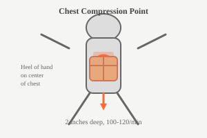

# CPR (Cardiopulmonary Resuscitation)

CPR is used when someone has stopped breathing or has no heartbeat. It can save a life in emergencies.

## When to Use CPR

- Person is unresponsive
- Not breathing or gasping
- No pulse detected

:::error
Call for emergency help first if possible. Begin CPR immediately if person is not breathing.
:::

## CPR Steps (Adult)

### 1. Check Response

1. Tap shoulders firmly
2. Ask loudly: "Are you okay?"
3. Check for breathing (look at chest for 10 seconds)

### 2. Position the Person

1. Lay person on their back
2. Place heel of one hand on center of chest
3. Place other hand on top, interlacing fingers
4. Keep arms straight, shoulders over hands

### 3. Perform Compressions

1. Push hard and fast
2. Depth: At least 2 inches
3. Rate: 100-120 compressions per minute
4. Allow full chest recoil between compressions
5. Minimize interruptions

### 4. Give Rescue Breaths (if trained)

1. Tilt head back, lift chin
2. Pinch nose
3. Give 2 breaths
4. Each breath about 1 second
5. Watch for chest rise

### 5. Continue Cycle

- 30 compressions : 2 breaths
- Continue until:
  - Help arrives
  - Person starts breathing
  - You are too exhausted to continue

:::tip
If not trained in rescue breaths, perform hands-only CPR - just continuous chest compressions.
:::

## CPR for Children (1-8 years)

- Use one or two hands (depending on child size)
- Compress about 2 inches deep
- Slightly faster rate

## CPR for Infants (under 1 year)

- Use two fingers on breastbone just below nipples
- Compress about 1.5 inches deep
- Cover mouth and nose with your mouth
- Give gentle breaths
